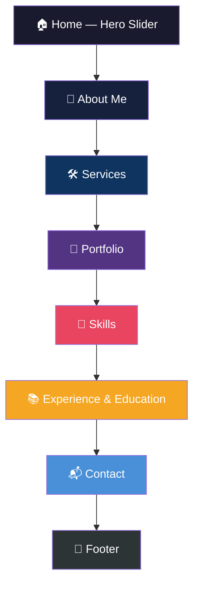
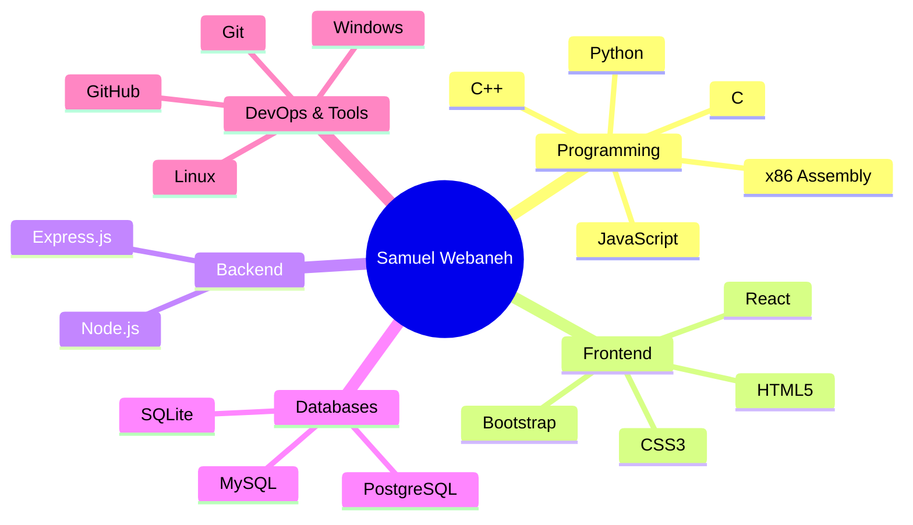
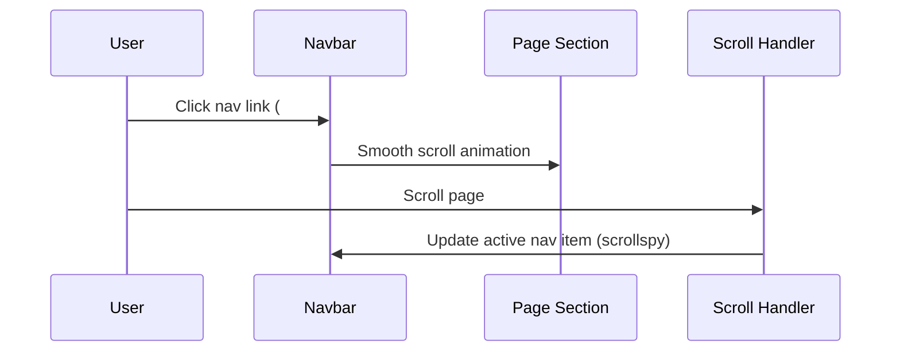

# Samuel Webaneh — Personal Portfolio

> **A modern, one-page portfolio website showcasing full-stack development skills, featured projects, and professional experience.**

[](https://developer.mozilla.org/en-US/docs/Web/HTML)
[](https://developer.mozilla.org/en-US/docs/Web/CSS)
[](https://getbootstrap.com/)
[](https://jquery.com/)
[](https://developer.mozilla.org/en-US/docs/Web/JavaScript)

**Live site:** [samuelwbaneh.com](https://samuelwbaneh.com) · **Repository:** [github.com/samuel9974/Persenal-Portfolio-Website](https://github.com/samuel9974/Persenal-Portfolio-Website)

**Quick links:** [Overview](#-overview) · [Features](#-features) · [Sections](#-page-sections) · [Portfolio Projects](#-featured-projects) · [Tech Stack](#-tech-stack) · [Getting Started](#-getting-started) · [Project Structure](#-project-structure)

---

## 📖 Overview

This is the **personal portfolio website** of **Samuel Webaneh** — a Computer Science student and full-stack developer. Built as a polished, single-page experience, the site presents professional identity, technical services, a curated project gallery, skills, education, and contact information in one scrollable layout.

The site is a **static front-end application** — no build step or backend server required. It runs directly in the browser and is optimized for fast loading, smooth scroll navigation, and responsive display across desktop and mobile devices.

| Attribute | Details |
| --------- | ------- |
| **Owner** | Samuel Webaneh |
| **Role** | Full-Stack Developer · Computer Science Student |
| **Education** | B.Sc. Computer Science — Hadassah Academic College |
| **Location** | Israel |
| **Website** | [samuelwbaneh.com](https://samuelwbaneh.com) |
| **LinkedIn** | [linkedin.com/in/samuel-webnek](https://www.linkedin.com/in/samuel-webnek/) |
| **GitHub** | [github.com/samuel9974](https://github.com/samuel9974) |

---

## ✨ Features

### 🎯 User Experience

- **One-page scroll layout** — All content accessible through smooth anchor navigation
- **Hero slider** — Owl Carousel with animated typing effect via Typed.js
- **Sticky navigation** — Fixed header with active section highlighting (scrollspy)
- **Scroll-to-top button** — Appears after scrolling, anchored to footer
- **Responsive design** — Bootstrap grid with dedicated `responsive.css` breakpoints
- **Scroll animations** — Waypoints-triggered fade-in effects on section entry
- **Downloadable CV** — Direct PDF download from the About section

### 🖼 Visual Design

- **Hexagonal profile photo** — SVG clip-path frame with decorative border
- **Section title blocks** — Consistent heading pattern with hexagon icon accents
- **Portfolio carousel** — Full-width Owl Carousel with hover overlay cards
- **Skills badge grid** — Shields.io technology badges organized by category
- **Split experience layout** — Work experience (dark) and education (light) side-by-side
- **Parallax & background overlays** — Footer and banner sections with cover images

### ⚡ Interactivity

- **Typed.js hero animation** — Rotating titles: *Full-Stack Developer*, *Software Developer*
- **Portfolio slider** — Responsive carousel (1 → 2 → 3 columns by breakpoint)
- **Match-height columns** — Equal-height cards in services and experience sections
- **Smooth scroll navigation** — Animated scroll to sections from header and footer links
- **External link handling** — Portfolio demo/GitHub links open in new tabs without popup interference

---

## 📄 Page Sections



| # | Section | ID | Description |
| - | ------- | -- | ----------- |
| 1 | **Home** | `#home` | Hero slider with typing animation, social links, scroll-down indicator |
| 2 | **About** | `#about` | Profile photo, professional summary, contact details, CV download |
| 3 | **Services** | `#services` | Six service cards covering full-stack development capabilities |
| 4 | **Portfolio** | `#portfolio` | Carousel of 7 featured projects with demo and GitHub links |
| 5 | **Skills** | `#skills` | Technology badges grouped by category |
| 6 | **Experience** | — | Work history and academic/personal project timeline |
| 7 | **Education** | — | Degree and preparatory program details |
| 8 | **Contact** | `#contact` | Phone and email contact cards |
| 9 | **Footer** | `#footer` | Logo, navigation, social links, copyright |

---

## 💼 Featured Projects

| Project | Stack | Demo | GitHub |
| ------- | ----- | ---- | ------ |
| **EvaNetflex Clone** | React · Vite · TMDB | [Live](https://netfffmovie.netlify.app/) | [Repo](https://github.com/samuel9974/EvaNetflexClone) |
| **AI-Powered Evangadi Forum** | React · Express · MySQL · Gemini | [Live](https://ai-forum.samuelwbaneh.com) | [Repo](https://github.com/samuel9974/AI_Powered_Forum) |
| **BuyZone** | React · Vite · Express · MySQL | — | [Repo](https://github.com/samuel9974/Amazon-Clone) |
| **Memory Matching Game** | JavaScript · Bootstrap · HTML5 · CSS3 | [Live](https://samuel9974.github.io/nasa-memory-game-apod/) | [Repo](https://github.com/samuel9974/nasa-memory-game-apod) |
| **Dynamic Task Manager** | JavaScript · Bootstrap · HTML5 · CSS3 | [Live](https://samuel9974.github.io/Dynamic-Task-Manager-Wep-App/) | [Repo](https://github.com/samuel9974/Dynamic-Task-Manager-Wep-App) |
| **Chatroom Web Application** | Node.js · Express · MySQL | [Live](https://samuel9974.github.io/chatroom-web-app/) | [Repo](https://github.com/samuel9974/chatroom-web-app) |
| **Sparky AI** | React · Vite · Express · MySQL · Gemini · JWT | [Live](https://chat.samuelwbaneh.com/) | [Repo](https://github.com/samuel9974/ChatGpt-Clone) |

---

## 🛠 Services Offered

| Service | Icon | Description |
| ------- | ---- | ----------- |
| **Frontend Development** | 🖥 | Responsive interfaces with React, JavaScript, HTML5, and CSS3 |
| **Backend Development** | ⚙️ | Scalable server-side apps with Node.js, Express, REST APIs, and auth |
| **Database & Data Modeling** | 🗄 | Relational database design, MySQL queries, and data structuring |
| **API Integration** | 🔗 | Third-party and internal API integration with async data flow |
| **Authentication & Security** | 🔒 | Secure password handling, RBAC, and security best practices |
| **Development & Deployment** | ☁️ | Git workflows, Linux environments, and production deployment |

---

## 🧠 Skills



---

## 🏗 Architecture

### Application flow

```mermaid
flowchart LR
    subgraph Browser["Browser"]
        HTML[index.html]
        CSS[style.css + responsive.css]
        JS[general.js + plugins]
    end

    subgraph Plugins["jQuery Plugins"]
        OWL[Owl Carousel]
        WP[Waypoints]
        TJS[Typed.js]
        MH[Match Height]
        MFP[Magnific Popup]
    end

    subgraph External["CDN / External"]
        FONTS[Google Fonts]
        FA[Font Awesome]
        SHIELDS[Shields.io Badges]
    end

    HTML --> CSS
    HTML --> JS
    JS --> OWL & WP & TJS & MH & MFP
    HTML --> FONTS & FA & SHIELDS
```



### Navigation flow



---

## 🛠 Tech Stack

| Category | Technology | Purpose |
| -------- | ---------- | ------- |
| **Markup** | HTML5 | Page structure and semantic sections |
| **Styling** | CSS3, Bootstrap 3 | Layout, typography, responsive grid |
| **Scripting** | JavaScript (ES5), jQuery | DOM manipulation and plugin orchestration |
| **Carousel** | Owl Carousel 2 | Hero slider and portfolio gallery |
| **Animation** | Animate.css, Typed.js, Waypoints | Scroll animations and typing effect |
| **Icons** | Font Awesome 4, ET Line Icons | UI icons across sections |
| **Utilities** | Match Height, Magnific Popup, Parallaxie | Layout equalization and media popups |
| **Fonts** | Open Sans, Montserrat (Google Fonts) | Body and heading typography |
| **Badges** | Shields.io | Dynamic skill badge images |

---

## 🚀 Getting Started

### Prerequisites

No build tools or package manager required. You only need:

- A modern web browser (Chrome, Firefox, Edge, Safari)
- A local web server *(optional but recommended for best asset loading)*

### Option 1 — Open directly

```bash
# Clone the repository
git clone https://github.com/samuel9974/Persenal-Portfolio-Website.git
cd Persenal-Portfolio-Website

# Open in browser (Windows)
start index.html
```

### Option 2 — Local dev server (recommended)

```bash
# Using Python
python -m http.server 8080

# Using Node.js (npx)
npx serve .

# Using VS Code Live Server extension
# Right-click index.html → "Open with Live Server"
```

Then visit `http://localhost:8080` (or the port shown by your server).

### Deployment

This is a **static site** — deploy to any static hosting provider:

| Platform | Method |
| -------- | ------ |
| **GitHub Pages** | Push to `main`, enable Pages in repo settings |
| **Netlify** | Connect repo or drag-and-drop the folder |
| **Vercel** | Import repo, set output to root directory |
| **Custom domain** | Point DNS to hosting provider (configured: `samuelwbaneh.com`) |

---

## 📁 Project Structure

```
Persenal-Portfolio-Website/
├── index.html                  # Main single-page application
├── README.md                   # Project documentation
├── css/
│   ├── style.css               # Primary stylesheet (~4,800 lines)
│   ├── responsive.css          # Mobile/tablet breakpoints
│   ├── bootstrap.min.css       # Bootstrap 3 grid & components
│   ├── animate.css             # CSS animation library
│   ├── font-awesome.min.css    # Icon font
│   ├── iconfont.css            # ET Line icons
│   ├── owl.carousel.min.css    # Carousel styles
│   ├── magnific-popup.css      # Lightbox/popup styles
│   └── snazzy-info-window.min.css
├── js/
│   ├── general.js              # Main app logic (sliders, scrollspy, animations)
│   ├── jquery.js               # jQuery core
│   ├── bootstrap.min.js        # Bootstrap JS
│   ├── owl.carousel.min.js     # Carousel plugin
│   ├── waypoints.min.js        # Scroll trigger plugin
│   ├── jquery.appear.js        # Element visibility detection
│   ├── jquery.matchHeight-min.js
│   ├── jquery.magnific-popup.min.js
│   ├── jquery.counterup.js
│   ├── jquery.easypiechart.min.js
│   ├── jquery.validate.js
│   ├── parallaxie.js
│   ├── smooth-scroll.js
│   ├── audioplayer.min.js
│   └── modernizr.min.js
├── images/
│   ├── Personal-image.jpg      # Profile photo
│   ├── samuel.png              # Logo / brand mark
│   ├── modules.jpg             # Hero slider background
│   ├── Netflex-logo.png        # Portfolio project thumbnails
│   ├── AI-Forum.png
│   ├── buyzone-banner.png
│   ├── memory-game-banner.png
│   ├── task-manager-banner.png
│   ├── chatroom-banner.png
│   ├── sparky-ai-banner.png
│   ├── education-logo.png
│   ├── mouse.svg               # Scroll-down indicator
│   └── bg/                     # Section background images
│       ├── footer-bg.jpg
│       ├── contact-bg.jpg
│       └── ...
├── fonts/                      # Font Awesome & Glyphicons webfonts
└── my_cv/
    └── Samuel-Webanek-CV-2026F.pdf   # Downloadable resume
```

---

## 🎨 Design System

| Token | Value | Usage |
| ----- | ----- | ----- |
| Body font | `Open Sans`, 15px | Primary text |
| Heading font | `Montserrat` | Titles and accents |
| Body color | `#666` | Default text |
| Primary accent | Theme gradient (yellow) | Buttons, back-to-top, highlights |
| Dark section | `#000` / black backgrounds | Header, experience panel |
| Light section | `#f7f7f7` / gray backgrounds | Services, education panel |
| Link hover | Smooth 300ms transitions | All interactive elements |

---

## 📬 Contact

| Channel | Details |
| ------- | ------- |
| **Email** | [samisancho1@gmail.com](mailto:samisancho1@gmail.com) |
| **Phone** | +972 55-663-1390 |
| **Website** | [samuelwbaneh.com](https://samuelwbaneh.com) |
| **LinkedIn** | [linkedin.com/in/samuel-webnek](https://www.linkedin.com/in/samuel-webnek/) |
| **GitHub** | [github.com/samuel9974](https://github.com/samuel9974) |

---

## 🗺 Roadmap

- [ ] Add a working contact form with backend or form service (Formspree / EmailJS)
- [ ] Implement portfolio category filters in the UI
- [ ] Add dark/light theme toggle
- [ ] Migrate from jQuery to vanilla JavaScript or a modern framework
- [ ] Add blog section for technical writing
- [ ] Optimize images for faster page load (WebP, lazy loading)
- [ ] Add Open Graph and Twitter Card meta tags for social sharing
- [ ] Set up automated deployment via GitHub Actions

---

## 📄 License

This project is open source and available for portfolio and educational purposes.

© 2026 **Samuel Webaneh**. All Rights Reserved.

---

<p align="center">
  <sub>Built with HTML · CSS · Bootstrap · jQuery · ❤️</sub><br>
  <a href="https://samuelwbaneh.com">samuelwbaneh.com</a>
</p>
